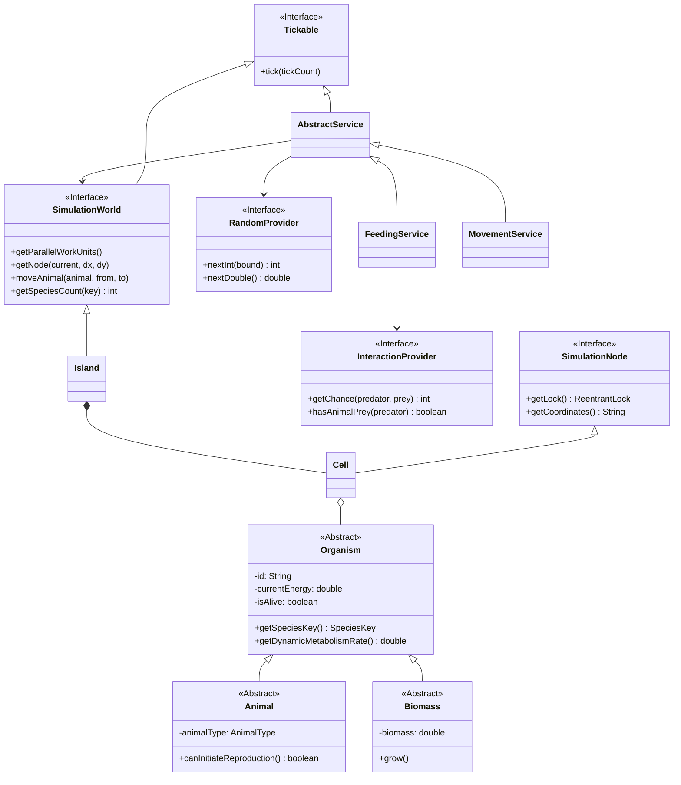

# Island Ecosystem Simulator Architecture (UML)

## Modular "Engine-First" Architecture

## System Patterns Applied

1.  **Flyweight (`AnimalType`)**: 
    - Static data (weight, speed, max count) for each species is stored once per type.
    - Saves massive memory with millions of organisms.

2.  **Strategy (`HuntingStrategy`)**:
    - Decouples prey selection logic from `FeedingService`.
    - Predators use ROI (Return on Investment) calculations to prioritize prey.

3.  **Bridge / Provider (`InteractionProvider`, `RandomProvider`)**:
    - Decouples core logic from specific implementations (Matrix vs dynamic rules, Real vs Mock random).
    - Enhances testability and flexibility.

4.  **Interface-Driven Engine**:
    - **`SimulationWorld`** and **`SimulationNode`** decouple services from the grid model.
    - Services operate on abstractions, allowing for future changes in topology (e.g. Hexagonal grid).

5.  **Composite (`Island` -> `Chunk` -> `Cell`)**:
    - Hierarchy that allows processing by chunks in parallel via `getParallelWorkUnits()`.

6.  **Virtual Threads (Project Loom)**:
    - High-performance task execution in `GameLoop` using `VirtualThreadPerTaskExecutor`.

## Key Mechanisms

- **Unified Lifecycle**: Everything that "acts" implements `Tickable`.
- **Spatial Abstraction**: Services don't know about `Island` coordinates; they ask `SimulationWorld` for neighboring `SimulationNode`.
- **Entity Container**: Cells delegate storage and indexing to a specialized `EntityContainer` (SRP).
- **Red Book Protection**: Automatic stealth and reproduction bonuses for endangered species.
- **Ordered Locking**: Prevents deadlocks during animal movement between cells by sorting locks based on node coordinates.

## How it Works (Architecture Flow)

1.  **Bootstrap**: `SimulationBootstrap` wires together the `Island`, `SpeciesRegistry`, `InteractionMatrix`, and `RandomProvider`.
2.  **Task Registration**: `TaskRegistry` creates services (Feeding, Movement, etc.) and registers them as `Tickable` tasks in the `GameLoop`.
3.  **Simulation Tick**:
    - `GameLoop` increments the global `tickCount`.
    - It iterates over all registered `Tickable` tasks.
    - **Parallel Execution**: Services split the world into `WorkUnits` (chunks) and process them in parallel using virtual threads.
    - **Synchronization**: Each `SimulationNode` (Cell) has a `ReentrantLock`. Services lock nodes before modifying their state to ensure thread safety.
4.  **Spatial Interaction**: When an entity moves or interacts across cells, the world manages the atomic transfer and locking order.
