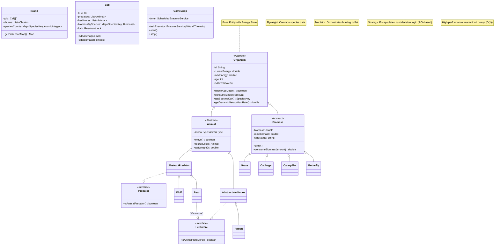

# Island Ecosystem Simulator Architecture (UML)

## Class Diagram Overview

## System Patterns Applied

1.  **Flyweight (`AnimalType`)**: 
    - Static data (weight, speed, max count) for each species is stored once per type.
    - Saves massive memory with millions of organisms.

2.  **Strategy (`HuntingStrategy`)**:
    - Decouples prey selection logic from `FeedingService`.
    - Predators use ROI (Return on Investment) calculations to prioritize prey.

3.  **Mediator (`PreyProvider`)**:
    - Centralizes predator-prey interaction logic within a cell.
    - Manages "hiding" state and dynamic "buffet" generation.

4.  **Composite (`Island` -> `Chunk` -> `Cell`)**:
    - Hierarchy that allows processing by chunks in parallel.

5.  **Virtual Threads (Project Loom)**:
    - High-performance task execution in `GameLoop`.
    - Near-infinite scalability for parallel cell processing.

6.  **Hybrid Hierarchy**:
    - Combination of Abstract Classes (performance) and Interfaces (flexibility).
    - Supports Omnivores (like Bear) through multiple interface implementation.

## Key Mechanisms

- **Biological Pendulum**: Cyclic biomass flow between Plants and Caterpillars (Feeding/Fertilizing).
- **Red Book Protection**: Automatic stealth mechanism for endangered species (pop < 5% of island capacity).
- **Energy Redistribution**: Parents and offspring share total energy during reproduction.
- **Ordered Locking**: Prevents deadlocks during animal movement between cells.
