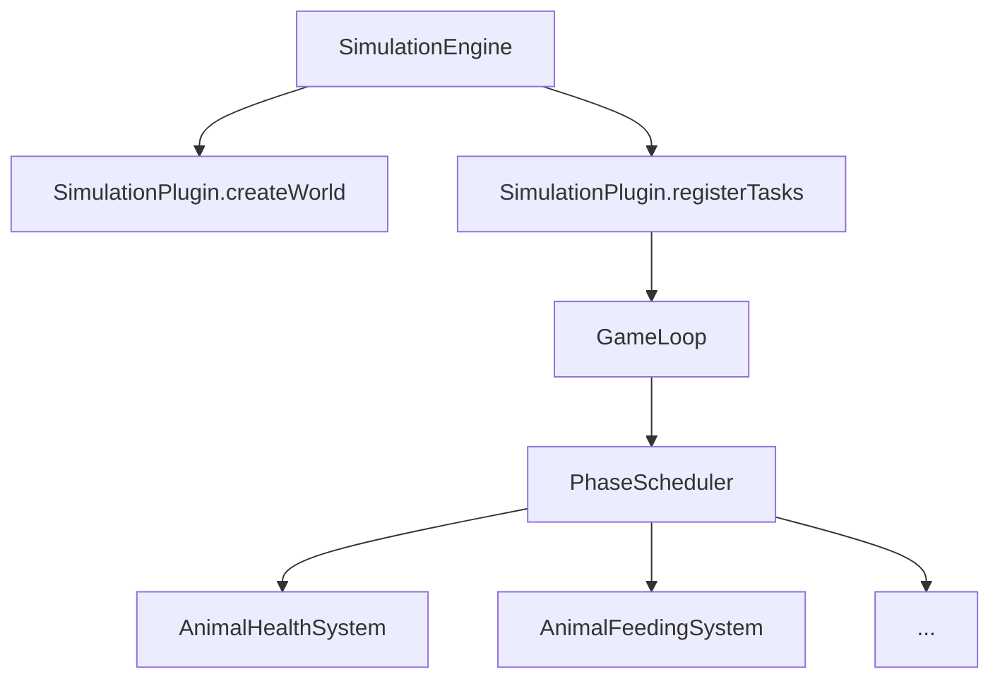

# Документация для команды: стратегия и план

**Для кого:** middle + junior разработчики, frontend-разработчики (стадия планирования)  
**Контекст:** `island-simulator` — многомодульный движок симуляции на Java 21 + JPMS  
**Текущее состояние:** документация существует (README, ARCHITECTURE, DOCUMENTATION, UML),
но написана для одного человека, а не для команды

---

## Что уже есть и что с этим делать

| Документ | Качество | Проблема | Действие |
|---|---|---|---|
| `README.md` | Хороший | Позиционирует проект как учебный; команде нужен рабочий гид | Переписать вводную часть |
| `docs/ARCHITECTURE.md` | Хороший | Хорошая схема, но нет примеров кода, нет пошаговых инструкций | Дополнить |
| `docs/DOCUMENTATION.md` | Детальный | Смешаны design patterns, SimCity описание, оптимизации — без структуры для читателя | Разбить на отдельные docs |
| `docs/UML.md` | Есть | Нужно проверить актуальность после ECS-рефакторинга | Актуализировать |
| `docs/CHANGELOG.md` | Есть | Не в формате Keep a Changelog | Привести к стандарту |

---

## Карта документации: что нужно создать

### Слой 1 — Onboarding (первый день в проекте)

```
docs/
├── CONTRIBUTING.md          ← правила работы в команде
├── ONBOARDING.md            ← гид новичка (первый день → первый PR)
├── GLOSSARY.md              ← словарь терминов
└── adr/                     ← Architecture Decision Records
    ├── 001-ecs-pattern.md
    ├── 002-soa-stores.md
    └── 003-jpms-modules.md
```

### Слой 2 — Разработка (ежедневное использование)

```
docs/
├── engine/
│   ├── PLUGIN_GUIDE.md      ← как написать новый плагин
│   ├── ECS_GUIDE.md         ← как работает ECS, как добавить Component/System
│   ├── EVENTS_CATALOG.md    ← все события EventBus
│   ├── SCHEDULING.md        ← Phase/priority система
│   └── CONFIGURATION.md     ← все параметры конфигурации
└── testing/
    ├── TESTING_GUIDE.md     ← как и что тестировать
    └── TEST_PATTERNS.md     ← примеры тест-паттернов из кодовой базы
```

### Слой 3 — Frontend API (планирование)

```
docs/
└── api/
    ├── REST_API.md          ← HTTP endpoints (когда появится сервер)
    ├── WEBSOCKET_API.md     ← стриминг состояния мира
    ├── DATA_MODEL.md        ← WorldSnapshot, NodeSnapshot, события
    └── FRONTEND_GUIDE.md   ← как подключиться и что рендерить
```

---

## Детальный план документов

---

### 📄 CONTRIBUTING.md (Слой 1, ПРИОРИТЕТ: ВЫСОКИЙ)

**Для кого:** все разработчики  
**Когда читают:** до первого PR  

```markdown
# Как работать в проекте

## Ветки
- `main` — production-ready, только через PR
- `dev` — основная ветка разработки
- `feature/TASK-XXX-short-description` — фича-ветки

## Процесс PR
1. Создать ветку от `dev`
2. Написать код + тесты
3. `mvn verify` должен проходить (включая Checkstyle, JaCoCo ≥58%)
4. Создать PR на `dev` → назначить ревьюера
5. Минимум 1 approve; после merge — удалить ветку

## Чеклист перед PR
- [ ] `mvn checkstyle:check` — нет ошибок
- [ ] `mvn test` — все тесты зелёные
- [ ] Новый код покрыт тестами
- [ ] Javadoc на публичные методы в `island-engine`
- [ ] Нет `TODO` без тикета

## Код-стиль
Проект использует Checkstyle (конфиг: `checkstyle.xml`).
Проверка запускается автоматически при `mvn verify`.

### Запреты
- ❌ Star imports (`import com.island.nature.*`)
- ❌ Прямое использование `engine.internal` из плагинов
- ❌ `System.out.println` — только `log.info/debug/warn/error`
- ❌ Изменение публичного API движка без обсуждения

## Commit messages
Формат: `type(scope): description`  
Типы: `feat`, `fix`, `refactor`, `test`, `docs`, `chore`  
Пример: `feat(nature): add BiomassGrowthSystem with GrowthComponent`
```

---

### 📄 ONBOARDING.md (Слой 1, ПРИОРИТЕТ: ВЫСОКИЙ)

**Для кого:** новые разработчики (junior и middle)  
**Цель:** от нуля до первого PR за один день  

```markdown
# Onboarding: первые шаги

## Требования
- Java 21 (проверить: `java --version`)
- Maven 3.8+ (проверить: `mvn --version`)
- IDE: IntelliJ IDEA рекомендуется (Lombok и JPMS поддержка из коробки)

## Шаг 1: Клонировать и собрать (10 минут)
git clone https://github.com/ursusandwolf/alex.kov.island.git
cd alex.kov.island
git checkout dev
mvn clean verify        # ← должно завершиться BUILD SUCCESS

## Шаг 2: Запустить симуляцию
mvn exec:java -pl island-app -Dexec.mainClass="com.island.NatureLauncher"

# В консоли вы увидите:
# Тик 1: 🐺 Wolves: 12 | 🐇 Rabbits: 84 | 🌿 Plants: 1240
# ...

## Шаг 3: Прочитать за 1 час
1. docs/GLOSSARY.md              — ключевые термины
2. docs/ARCHITECTURE.md          — общая картина
3. docs/engine/ECS_GUIDE.md     — как устроены сущности

## Шаг 4: Первая задача — добавить логирование
Измените `island-nature/src/main/java/.../service/AnimalHealthSystem.java`:
найдите метод `process()` и добавьте `log.debug(...)` для отладки.
Запустите тесты: `mvn test -pl island-nature`

## Структура проекта
island-engine/    — движок (НЕ трогать без согласования)
island-nature/    — плагин экосистемы
island-simcity/   — плагин городского симулятора
island-app/       — точки входа (Launcher-ы), ArchUnit-тесты

## Куда обращаться
- Код-вопросы: ревью PR или обсуждение в issue
- Архитектурные решения: см. docs/adr/
```

---

### 📄 GLOSSARY.md (Слой 1, ПРИОРИТЕТ: ВЫСОКИЙ)

**Для кого:** все, особенно junior и frontend  

```markdown
# Глоссарий

## Движок (Engine)

| Термин | Определение |
|---|---|
| **Тик (Tick)** | Один шаг симуляции. По умолчанию 100ms. Все изменения мира происходят дискретно, тик за тиком |
| **Plugin** | Реализация `SimulationPlugin<T>` — домен симуляции (природа, город). Движок управляет жизненным циклом |
| **GameLoop** | Главный цикл: tick → выполнить задачи по фазам → sleep → повторить |
| **Phase** | Этап выполнения задач в тике: `PREPARE` → `SIMULATION` → `POSTPROCESS` |
| **ScheduledTask** | Любая задача, зарегистрированная в GameLoop. Имеет phase и priority |
| **CellService** | Задача, обрабатывающая каждую ячейку мира (выполняется параллельно по чанкам) |
| **EntitySystem** | CellService с ECS-контрактом: объявляет `readComponents()`/`writeComponents()` |
| **EventBus** | Шина событий. Publish/Subscribe без прямых зависимостей между компонентами |
| **WorkUnit** | Один чанк (часть мира) для параллельной обработки. Содержит несколько ячеек |
| **WorldSnapshot** | Снимок состояния мира для рендеринга. Создаётся в конце тика |

## ECS (Entity-Component-System)

| Термин | Определение |
|---|---|
| **Entity** | Сущность с уникальным `entityId`. Хранит набор Component-ов |
| **Component** | Данные без логики. Пример: `HealthComponent` (маркер), данные в `HealthSoAStore` |
| **System** | Логика без данных. Обрабатывает все сущности с нужными компонентами |
| **ComponentRegistry** | Реестр типов компонентов. Назначает каждому типу уникальный индекс |
| **EntityArchetype** | Уникальный набор компонентов. Используется для быстрой фильтрации в `EntityQuery` |
| **SoA (Struct of Arrays)** | Паттерн хранения данных: не `[{energy, age, alive}, ...]` а `{energy[], age[], alive[]}`. Лучше для CPU cache |
| **ComponentStore** | Хранилище компонентов одной сущности. Реализации: `DefaultComponentStore` (HashMap), `ArrayComponentStore` (массив) |

## Природный плагин (Nature)

| Термин | Определение |
|---|---|
| **Island** | Реализация `SimulationWorld` — прямоугольная сетка ячеек (`Cell`) |
| **Cell** | Узел сетки. Содержит животных и биомассу. Потокобезопасен (`ReentrantLock`) |
| **Animal** | Индивидуальная сущность (волк, заяц). Имеет `entityId`, `HealthComponent`, `AgeComponent`, `MovementComponent` |
| **Biomass** | Агрегированная масса (растения, гусеницы). Не индивидуальные объекты — экономия памяти |
| **SpeciesKey** | Уникальный идентификатор вида: `SpeciesKey.WOLF`, `SpeciesKey.RABBIT` и т.д. |
| **DeathCause** | Причина смерти: `HUNGER`, `AGE`, `EATEN`, `EATEN_BY_PACK`, `MOVEMENT_EXHAUSTION`, `REPRODUCTION_EXHAUSTION` |
| **Season** | Текущий сезон: `SPRING`, `SUMMER`, `AUTUMN`, `WINTER`. Влияет на метаболизм |
| **LOD** | Level of Detail. Механизм семплирования: не все сущности обрабатываются каждый тик |
| **Red Book** | Защита вымирающих видов. Если популяция < 5% от максимума — бонусы к размножению |
| **Basis Points (BP)** | Единица измерения вероятностей и коэффициентов. 100 BP = 1%. Вся арифметика целочисленная |

## Городской плагин (SimCity)

| Термин | Определение |
|---|---|
| **CityMap** | Реализация `SimulationWorld` — сетка тайлов (`CityTile`) |
| **CityTile** | Узел городской сетки. Хранит `SimEntity`-объекты |
| **SimEntity** | Универсальная сущность SimCity: здание, житель, инфраструктура |
| **Desirability** | Привлекательность тайла (0-100). Зависит от инфраструктуры и загрязнения |
| **Density** | Плотность застройки: `LOW` → `MEDIUM` → `HIGH`. Растёт при высокой Desirability |
| **Wealth Tier** | Уровень богатства жителей: `POOR` → `MIDDLE` → `WEALTHY`. Влияет на налоги |
```

---

### 📄 PLUGIN_GUIDE.md (Слой 2, ПРИОРИТЕТ: ВЫСОКИЙ для middle)

**Для кого:** middle-разработчики, создающие новый плагин или расширяющие существующий  

```markdown
# Как написать новый плагин

## Минимальный плагин за 5 шагов

### Шаг 1: Создать Maven-модуль
<!-- в parent pom.xml: -->
<modules>
    <module>island-engine</module>
    <module>island-nature</module>
    <module>island-simcity</module>
    <module>island-myplugin</module>  <!-- добавить -->
    <module>island-app</module>
</modules>

<!-- island-myplugin/pom.xml -->
<parent>island-simulator-parent</parent>
<artifactId>island-myplugin</artifactId>
<dependencies>
    <dependency>
        <groupId>com.island</groupId>
        <artifactId>island-engine</artifactId>
    </dependency>
</dependencies>

### Шаг 2: Определить тип сущности
public class MyEntity implements Mortal {
    @Override public boolean isAlive() { ... }
    @Override public void die() { ... }
    @Override public String getTypeName() { return "MyEntity"; }
}

### Шаг 3: Реализовать мир (SimulationWorld)
public class MyWorld implements SimulationWorld<MyEntity> {
    // минимальная реализация: сетка ячеек, getParallelWorkUnits(), createSnapshot()
}

### Шаг 4: Реализовать плагин
public class MyPlugin implements SimulationPlugin<MyEntity> {
    @Override
    public SimulationWorld<MyEntity> createWorld(EventBus eventBus) {
        return new MyWorld(...);
    }

    @Override
    public void registerTasks(GameLoop<MyEntity> loop, SimulationWorld<MyEntity> world, EventBus bus) {
        loop.addRecurringTask(new MySystem());
    }
}

### Шаг 5: Запустить
SimulationConfig cfg = SimulationConfig.defaultFor(4);
try (SimulationContext<MyEntity> ctx = new SimulationEngine<MyEntity>().start(new MyPlugin(), cfg)) {
    Thread.sleep(5000);
}
```

---

### 📄 ECS_GUIDE.md (Слой 2, ПРИОРИТЕТ: ВЫСОКИЙ)

**Для кого:** все разработчики, работающие с entity-системами  

```markdown
# ECS: Как добавить Component и System

## Концепция за 1 минуту
ДАННЫЕ → Component  |  ЛОГИКА → System  |  ФИЛЬТРАЦИЯ → EntityQuery

## Добавить новый Component (5 минут)

// 1. Создать маркер в нужном плагине
public class HungerComponent implements Component { }
// Если нужны данные — поля в сопутствующем SoAStore или в Component
public class HungerComponent implements Component {
    private volatile int hungerLevel = 0;
    public int getHungerLevel() { ... }
    public void setHungerLevel(int level) { ... }
}

// 2. Добавить в ComponentFactory
public static void addHungerComponent(Entity entity) {
    entity.addComponent(new HungerComponent());
}

// 3. Добавить в AnimalFactory (если нужен всем животным)
animal.addComponent(new HungerComponent());

## Добавить новую System (15 минут)

// Для nature: наследовать NatureEntitySystem
public class HungerSystem extends NatureEntitySystem {

    @Override
    public List<Class<? extends Component>> requiredComponents() {
        return List.of(HungerComponent.class, HealthComponent.class);
        // Только сущности с ОБОИМИ компонентами попадут в process()
    }

    @Override
    public List<Class<? extends Component>> writeComponents() {
        return List.of(HungerComponent.class); // что пишем — для SystemExecutionGraph
    }

    @Override
    public int priority() {
        return TaskRegistry.PRIORITY_LIFECYCLE - 5; // запуститься чуть раньше Lifecycle
    }

    @Override
    protected void process(Organism entity, Cell cell, int tickCount) {
        HungerComponent hunger = entity.getComponent(HungerComponent.class);
        hunger.setHungerLevel(hunger.getHungerLevel() + 1);
        if (hunger.getHungerLevel() > 100) {
            entity.die(DeathCause.HUNGER);
        }
    }
}

// Зарегистрировать в TaskRegistry.registerAll():
gameLoop.addRecurringTask(new HungerSystem(domainContext));
```

---

### 📄 SCHEDULING.md (Слой 2, ПРИОРИТЕТ: СРЕДНИЙ)

**Для кого:** middle-разработчики, добавляющие новые сервисы  

```markdown
# Система фаз и приоритетов

## Порядок выполнения в тике

PREPARE (Phase.PREPARE)
  priority=100: ClimateService      — обновить сезон/температуру
  priority= 30: DesirabilityService — рассчитать привлекательность тайлов

SIMULATION (Phase.SIMULATION)  — параллельно по чанкам
  priority= 90: AnimalHealthSystem      — метаболизм, возраст
  priority= 80: AnimalFeedingSystem     — кормление хищников и травоядных
  priority= 70: AnimalMovementSystem    — движение
  priority= 60: AnimalReproductionSystem — размножение
  priority= 10: CleanupService          — удаление мёртвых

POSTPROCESS (Phase.POSTPROCESS)
  priority=  0: ViewService             — рендеринг ConsoleView

## Правила при добавлении нового сервиса
1. Определить Phase: нужны ли данные из PREPARE? → SIMULATION или POSTPROCESS
2. Определить priority: выше числа = раньше выполняется
3. Объявить readComponents()/writeComponents() для SystemExecutionGraph
4. Зарегистрировать в TaskRegistry с именованной константой:
   public static final int PRIORITY_MY_SERVICE = 75; // между Feed и Move
```

---

### 📄 EVENTS_CATALOG.md (Слой 2, ПРИОРИТЕТ: ВЫСОКИЙ для frontend)

**Для кого:** все разработчики + frontend  

```markdown
# Каталог событий EventBus

## Природный плагин (com.island.nature.event)

### AnimalBornEvent
Публикуется: Island.onEntityAdded() когда Animal добавляется в ячейку
Поля:
  animal: Animal — новорождённое животное

### AnimalDiedEvent  
Публикуется: Island.onEntityRemoved() когда Animal удаляется из ячейки
Поля:
  animal:  Animal     — погибшее животное
  cause:   DeathCause — причина (HUNGER | AGE | EATEN | EATEN_BY_PACK |
                                  MOVEMENT_EXHAUSTION | REPRODUCTION_EXHAUSTION)

## Как подписаться (Java)
eventBus.subscribe(AnimalDiedEvent.class, event -> {
    log.info("{} died: {}", event.getAnimal().getSpeciesKey(), event.getCause());
});

## Как подписаться (Frontend, когда будет WebSocket)
// Планируемый формат — см. docs/api/WEBSOCKET_API.md
{ "type": "ANIMAL_DIED", "payload": { "species": "wolf", "cause": "HUNGER", "x": 3, "y": 5 } }

## Расширение каталога
При добавлении нового события:
1. Создать класс в com.island.{plugin}.event
2. Добавить в этот каталог
3. Обновить docs/api/WEBSOCKET_API.md (для frontend)
```

---

### 📄 TESTING_GUIDE.md (Слой 2, ПРИОРИТЕТ: ВЫСОКИЙ для junior)

**Для кого:** все разработчики, особенно junior  

```markdown
# Гид по тестированию

## Типы тестов в проекте

| Тип | Где | Когда писать | Примеры |
|---|---|---|---|
| Unit | `*/src/test/java` | Для каждого нового класса | `AnimalHealthSystemTest`, `ECSTest` |
| Boundary | `*/test/...BoundaryTest` | Для граничных условий (0, max, -1) | `SimCityBoundaryTest` |
| Integration | `*/test/.../integration/` | Для взаимодействия нескольких компонентов | `EcosystemBalanceTest` |
| Architecture | `island-app/test/ArchitectureTest` | При изменении зависимостей модулей | `ArchitectureTest` |

## Золотые правила

### Правило 1: Тестировать через публичный API
// ❌ Плохо — тестируем внутреннее состояние
PhaseScheduler scheduler = new PhaseScheduler(dispatcher);
scheduler.execute(world, tasks, 1, 100L);

// ✅ Хорошо — тестируем через SimulationEngine
try (SimulationContext<T> ctx = engine.start(plugin, config)) {
    ctx.gameLoop().runTick();
    assertThat(ctx.world().createSnapshot().getTotalEntityCount()).isPositive();
}

### Правило 2: @DisplayName на каждом тесте
// ❌
void test1() { ... }

// ✅
@Test
@DisplayName("Animal should die when energy reaches zero")
void animal_dies_at_zero_energy() { ... }

### Правило 3: Arrange-Act-Assert (AAA) структура
@Test
@DisplayName("Wolf should lose energy when moving")
void wolf_loses_energy_on_move() {
    // Arrange
    Animal wolf = animalFactory.create(SpeciesKey.WOLF, cell);
    long energyBefore = wolf.getCurrentEnergy();

    // Act
    movementSystem.process(wolf, cell, 1);

    // Assert
    assertThat(wolf.getCurrentEnergy()).isLessThan(energyBefore);
}

## Запуск тестов
mvn test                              # все тесты
mvn test -pl island-engine            # только engine
mvn test -Dtest=AnimalHealthSystemTest # один класс
mvn jacoco:report                     # coverage отчёт → target/site/jacoco/index.html
```

---

## Документация для Frontend-разработчиков

> ⚠️ Frontend в стадии планирования. Раздел описывает контракты, которые backend
> должен предоставить. Согласовать до начала разработки обеих сторон.

---

### 📄 DATA_MODEL.md — модель данных для рендеринга

```markdown
# Модель данных для Frontend

## WorldSnapshot (снимок состояния мира)

Создаётся в конце каждого тика. Frontend получает его для рендеринга.

{
  "tickCount": 142,          // номер текущего тика
  "width": 20,               // ширина мира в ячейках
  "height": 20,              // высота мира в ячейках
  "totalEntityCount": 1284,  // общее число сущностей
  "metrics": {               // доменные метрики (зависят от плагина)
    // Nature плагин:
    "wolf_count": 12,
    "rabbit_count": 84,
    "bear_count": 3,
    "plant_biomass": 124000,
    "total_deaths": 5,
    "total_births": 8
    // SimCity плагин:
    // "population": 1200,
    // "happiness_avg": 72,
    // "money": 45000,
    // "tax_revenue_last_tick": 1200
  },
  "nodes": [                 // массив ячеек (width × height)
    {
      "coordinates": "0,0",
      "topSpeciesCode": "rabbit",   // наиболее многочисленный вид
      "topSpeciesIsPlant": false,
      "hasOrganisms": true
    }
    // ...
  ]
}
```

**Важно для рендеринга:**
- `nodes` — плоский массив, индекс `i = y * width + x`
- `topSpeciesCode` — строка-ключ вида: `"wolf"`, `"rabbit"`, `"bear"`, `"mushroom"`, `"grass"` (Nature) | `"road"`, `"residential"`, `"industrial"` (SimCity)
- `metrics` — содержимое зависит от активного плагина. Ключи фиксированы в `docs/api/DATA_MODEL.md`

---

### 📄 WEBSOCKET_API.md — стриминг для реального времени

```markdown
# WebSocket API (планирование)

## Концепция

Клиент подключается → сервер стримит WorldSnapshot каждые N тиков.
Frontend не управляет симуляцией (только наблюдает).
Управление — через отдельный REST API.

## Планируемый URL
ws://localhost:8080/ws/simulation/{pluginName}

## Сообщения от сервера → клиент

### tick_snapshot (каждый тик или каждые N тиков)
{
  "type": "tick_snapshot",
  "payload": { /* WorldSnapshot */ }
}

### entity_event (по событию)
{
  "type": "entity_event",
  "eventName": "ANIMAL_DIED",   // или ANIMAL_BORN
  "payload": {
    "species": "wolf",
    "cause": "HUNGER",           // только для ANIMAL_DIED
    "x": 3,
    "y": 5
  }
}

### simulation_stopped
{
  "type": "simulation_stopped",
  "reason": "EXTINCTION"   // или "USER_STOP", "ERROR"
}

## Сообщения клиент → сервер (планируется)
{ "type": "set_speed", "ticksPerSecond": 5 }
{ "type": "pause" }
{ "type": "resume" }

## Частота обновлений
- По умолчанию: 1 snapshot каждые 5 тиков
- Минимум: 1 тик (realtime)
- Максимум: 1 раз в 10 секунд (slow mode)
- Настраивается параметром подключения: `?snapshotInterval=5`
```

---

### 📄 REST_API.md — управление симуляцией

```markdown
# REST API (планирование)

## Базовый URL
http://localhost:8080/api/v1

## Endpoints

POST   /simulation/start         Запустить симуляцию
       Body: { "plugin": "nature", "config": { "width": 20, "height": 20 } }
       Response: { "id": "sim-123", "wsUrl": "ws://..." }

POST   /simulation/{id}/stop     Остановить
POST   /simulation/{id}/pause    Поставить на паузу
POST   /simulation/{id}/resume   Возобновить

GET    /simulation/{id}/snapshot  Получить текущий WorldSnapshot
GET    /simulation/{id}/metrics   Получить только metrics (без nodes, легче)
GET    /simulation/{id}/config    Получить текущую конфигурацию

PATCH  /simulation/{id}/config
       Body: { "tickDurationMs": 50 }   // изменить скорость на ходу

GET    /plugins                  Список доступных плагинов
GET    /plugins/{name}/config-schema  JSON Schema конфигурации плагина

## HTTP Status коды
200  OK
201  Created (после /start)
404  Simulation not found
409  Conflict (start когда уже запущено)
422  Invalid config
500  Internal error
```

---

### 📄 FRONTEND_GUIDE.md — руководство для Frontend-разработчика

```markdown
# Руководство для Frontend разработчика

## Что рендерить и как

### Сетка мира (Grid)
- Получить `WorldSnapshot.nodes[]` (плоский массив, `width × height`)
- Индекс ячейки: `i = y * width + x`
- `topSpeciesCode` → цвет или иконка (см. таблицу ниже)
- `hasOrganisms=false` → пустая ячейка (серый фон)

### Маппинг видов → цвет/иконка (Nature плагин)
| species code  | Визуализация     | Цвет (hex)  |
|---|---|---|
| `wolf`        | 🐺               | `#6B4C3B`   |
| `bear`        | 🐻               | `#8B4513`   |
| `fox`         | 🦊               | `#D2691E`   |
| `rabbit`      | 🐇               | `#F5DEB3`   |
| `deer`        | 🦌               | `#DEB887`   |
| `grass`       | 🌿               | `#228B22`   |
| `mushroom`    | 🍄               | `#8B008B`   |
| `butterfly`   | 🦋               | `#FFD700`   |

### Панель метрик
Использовать `WorldSnapshot.metrics`:
- График по времени: накапливать массив snapshots, рисовать sparkline
- Индикаторы: текущие значения из последнего snapshot

### Частота обновлений и производительность
- При `tickDurationMs=100` (10 тиков/сек) — НЕ рендерить каждый тик
- Рекомендация: рендер каждые 200ms (requestAnimationFrame)
- Буферизовать snapshots на клиенте: очередь из N последних

## Технологический стек (рекомендации, не обязательны)
- WebSocket: нативный WebSocket API или socket.io
- Canvas: HTML5 Canvas для сетки (лучше производительность чем DOM)
- Charts: Recharts или Chart.js для метрик
- State: React + useState / Zustand для буфера snapshots
```

---

## ADR — Architecture Decision Records

**Для кого:** все разработчики, особенно новые  
**Зачем:** объясняет «почему так», а не «как»  

Структура каждого ADR:
```markdown
# ADR-001: ECS Pattern для природных сущностей

**Дата:** 2026-04-15  
**Статус:** Accepted  

## Контекст
Сервисы симуляции делали instanceof-проверки для Animal vs Biomass.
При добавлении нового типа сущности нужно было изменять все сервисы.

## Решение
Ввести ECS (Entity-Component-System): компоненты несут данные,
системы объявляют requiredComponents() для фильтрации.

## Последствия
✅ Новый тип сущности = новый Component, не изменение сервисов  
✅ SystemExecutionGraph автоматически определяет параллельные батчи  
❌ Данные и логика разделены — сложнее для junior разработчиков  
❌ Нужно поддерживать синхронизацию Component и SoAStore

## Альтернативы которые рассматривались
- Visitor pattern: отклонён из-за сложности при добавлении новых типов
- Полиморфизм: отклонён из-за instanceof в базовых классах
```

**Минимально нужные ADR для проекта:**
- `ADR-001-ecs-pattern.md` — почему ECS, а не полиморфизм
- `ADR-002-soa-stores.md` — почему AtomicLongArray, а не HashMap
- `ADR-003-jpms-modules.md` — почему JPMS, что экспортируется
- `ADR-004-event-bus.md` — почему EventBus вместо прямых вызовов
- `ADR-005-multi-module-maven.md` — структура модулей

---

## Приоритизированный план создания

| Приоритет | Документ | Трудоёмкость | Ответственный |
|---|---|---|---|
| 🔴 **P1 (неделя 1)** | `CONTRIBUTING.md` | 2 часа | Lead |
| 🔴 **P1** | `ONBOARDING.md` | 3 часа | Lead + Middle |
| 🔴 **P1** | `GLOSSARY.md` | 3 часа | любой Middle |
| 🟡 **P2 (неделя 2)** | `PLUGIN_GUIDE.md` | 4 часа | Middle |
| 🟡 **P2** | `ECS_GUIDE.md` | 4 часа | Middle |
| 🟡 **P2** | `TESTING_GUIDE.md` | 3 часа | Middle + Junior |
| 🟡 **P2** | `EVENTS_CATALOG.md` | 2 часа | Middle |
| 🟡 **P2** | ADR (3-5 штук) | 1-2 часа каждый | Lead |
| 🟢 **P3 (до старта frontend)** | `DATA_MODEL.md` | 4 часа | Backend + Frontend |
| 🟢 **P3** | `WEBSOCKET_API.md` | 4 часа | Backend + Frontend |
| 🟢 **P3** | `REST_API.md` | 3 часа | Backend |
| 🟢 **P3** | `FRONTEND_GUIDE.md` | 3 часа | Frontend Lead |
| 🔵 **P4 (по мере роста)** | `CONFIGURATION.md` | 2 часа | любой |
| 🔵 **P4** | `SCHEDULING.md` | 2 часа | Middle |
| 🔵 **P4** | `TEST_PATTERNS.md` | 2 часа | Middle |

**Итого:** ~50 часов. Распределить на 2-3 недели параллельно с разработкой.
Документация пишется как часть Definition of Done каждой фичи, а не отдельным спринтом.

---

## Рекомендации по форматированию и размещению

**Где хранить:** в репозитории рядом с кодом (`docs/`). Документация — часть
кодовой базы, обновляется в том же PR что и код.

**Язык:** единый для всей команды. Если команда русскоязычная — на русском.
Javadoc (публичный API) — на английском (стандарт для библиотек).

**Диаграммы:** использовать Mermaid (рендерится в GitHub/GitLab нативно):


**Актуализация:** добавить в `CONTRIBUTING.md` правило:  
*«Если PR меняет поведение, конфигурацию или публичный API — обновить docs/ в том же PR»*
