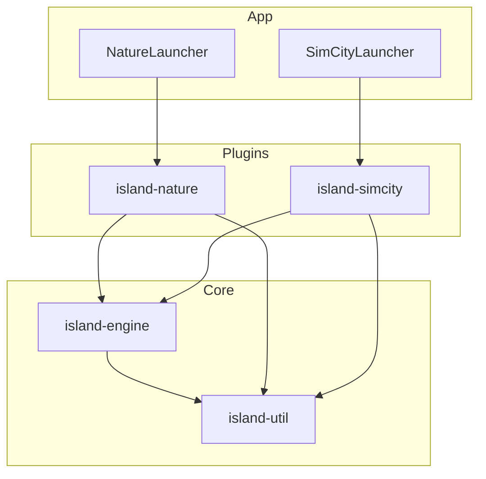
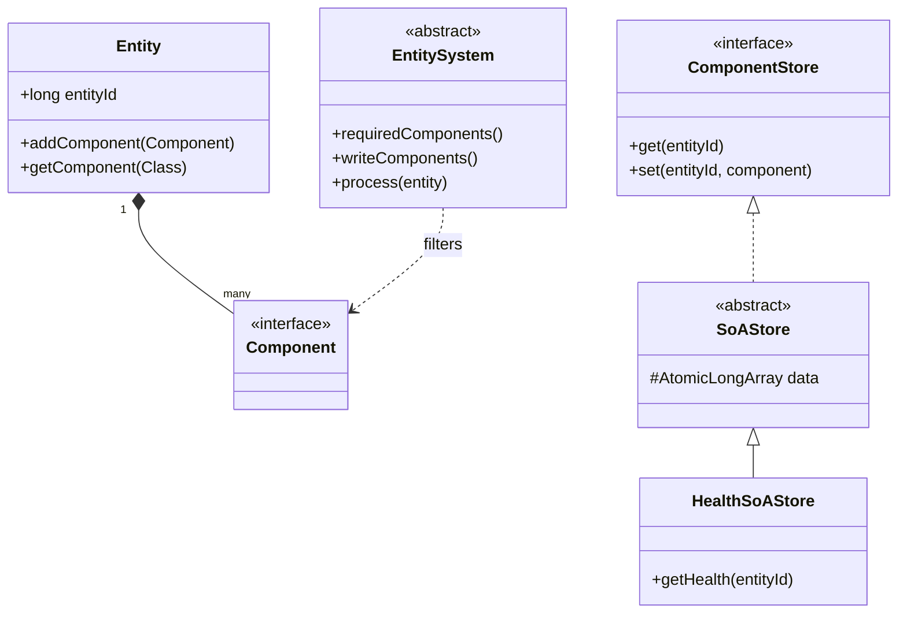
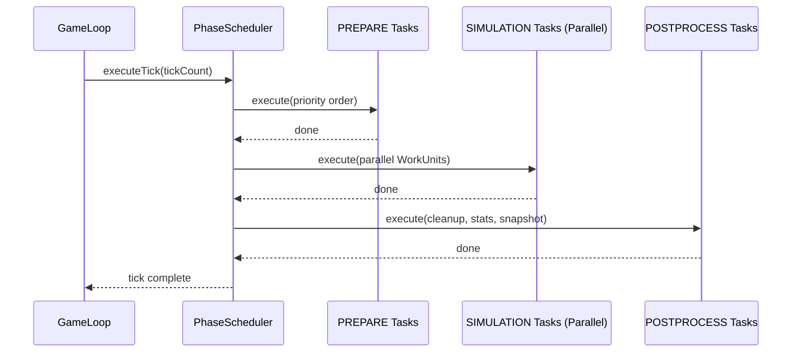
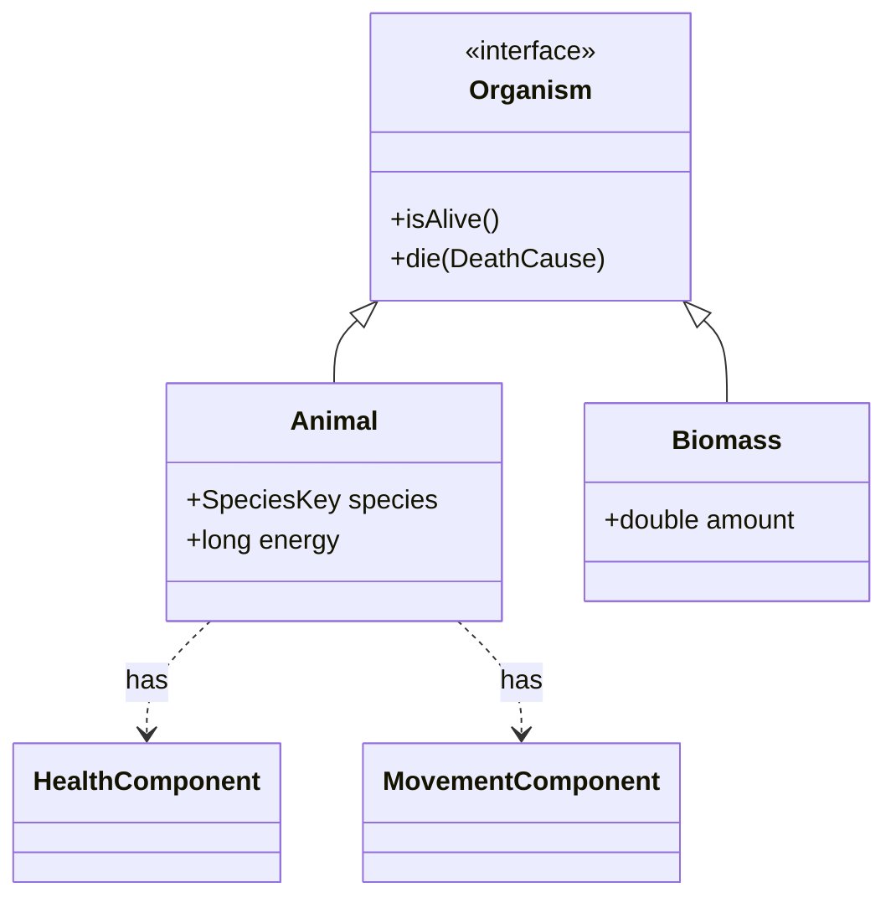
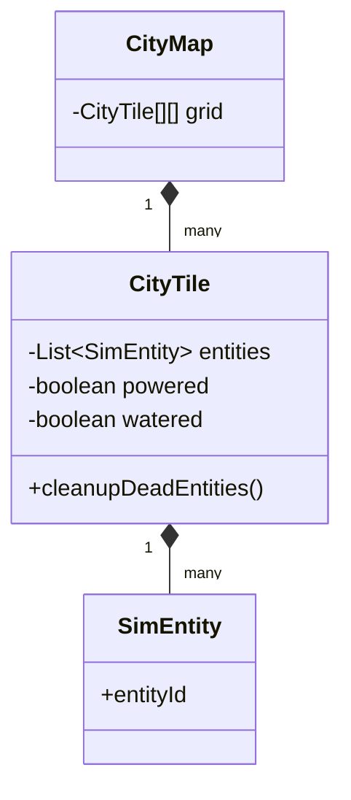

# Архитектура проекта (UML)

## Общая схема модулей и зависимостей



## ECS & SoA Architecture (Engine)



## Жизненный цикл Тика (Scheduling)



## Иерархия сущностей (Nature Plugin)



## Карта города (SimCity Plugin)



## Spring Boot & React Integration (Phase 4)

```mermaid
graph LR
    subgraph UI_Layer [island-ui (React + Vite)]
        RD[React Dashboard]
        RC[HTML5 Canvas]
        ZS[Zustand Store]
        RD --- ZS
        RD --- RC
    end

    subgraph App_Layer [island-app (Spring Boot)]
        SC[SimulationController]
        SS[SimulationService]
        SB[SimulationBroadcaster]
        JC[SimulationJacksonConfig]
        GE[GlobalExceptionHandler]
    end

    subgraph Core_Layer [island-engine]
        SE[SimulationEngine]
        CX[SimulationContext]
        GL[GameLoop]
        NP[NamedSimulationPlugin]
    end

    RD -- REST API --> SC
    ZS -- STOMP --> SB
    SC -- Lifecycle --> SS
    SS -- Registry --> NP
    SS -- Manages --> SE
    SE -- Produces --> CX
    CX -- Provides --> GL
    GL -- Registers --> SB
    SB -- Serializes --> WS[WorldSnapshot]
    WS -- Broadcast --> ZS
    SC -.-> GE
```
